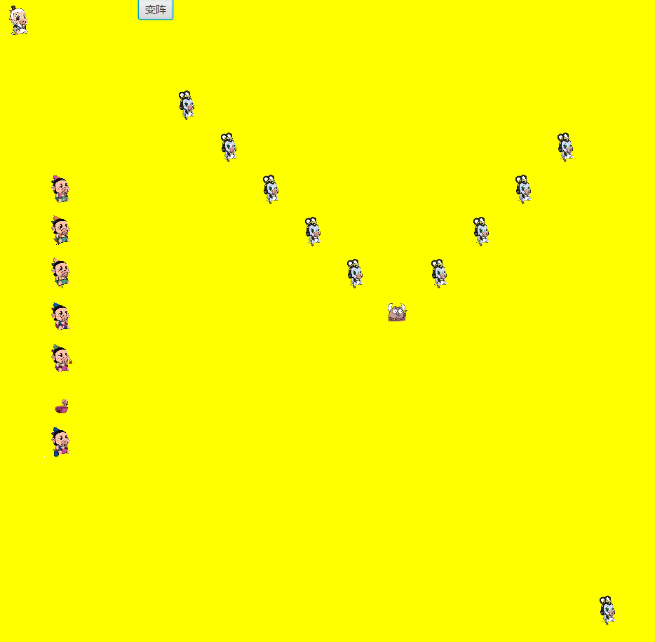

[TOC]

# game v2

## 版本说明：

- 添加了GUI（javafx）
  - 这里遇到一些问题：我们知道**人物形象**可以说是所有**生物（creature）**共有的属性。但是不同的GUI框架存形象的**对象**不相同，例如：javafx里面**Image**存图片，swing用ImageIcon存。因此不同框架这个属性的类型不相同，而不能因为不同的GUII框架就去修改后端的逻辑。所以我想到两个解决办法
    - 1.利用泛型，将此条属性设置为泛型，在RTT时生成（这次是这样做的），但这样的做法导致原本非常简单的代码变得十分的冗杂。要将这个类的class逐层的传到creature里面。
    - 2.因为不管设么形象都是读取本地（或网上）的图片，这是设置一个String类型存资源位置即可
- 运用了Collection
  - 将**正义**和**邪恶**阵营的怪物数组都用List代替
- 更细致的划分了怪物
  - 将葫芦娃，怪物更加具体化了。


## GUI(javafx)

- javafx设计目前只是简单的显示，用了一个GameModel类来讲UI和游戏逻辑绑定(这里就得看出用泛型去传递Image类的信息的不好之处，基本上代码的每个类都需要去传递)

```java
public class GameModel<T> {
    private Board board;
    private JustSide<T> justSide;
    private EvilSide<T> evilSide;

    public GameModel(Class<T> tClass) {
        this.board = new Board();
        Sides.formation = new Formation(this.board);

        this.justSide = new JustSide<>(tClass);
        this.evilSide = new EvilSide<>(tClass);
    }

    public Board getBoard() {
        return board;
    }

    public JustSide getJustSide() {
        return justSide;
    }

    public EvilSide getEvilSide() {
        return evilSide;
    }
}
```


## Collection使用

```java
public class Sides <T>{
    ...
    ArrayList<Creature<T>> creatures;
    ...
}
```


## 效果展示



# homework3

- 本次实现的主要是一群**生物**（Creature）在**战场**上（Board）上排列布阵。通过一个**位置**（Position）实体将两者关联起来。实际上，**战场**是一个关于**位置**的二维数组，一个**生物**会与一个**位置**相关联。由于战争是由两个阵营发生的，故会有一个**阵营**（Sides）实体。
- 真正的游戏中战场上是比**生物**更加具体的实体，由于是葫芦娃的作业，所以由**生物**这个实体派生出许多丰富的人物：**葫芦娃**（CalabashBrother）、**爷爷**（GrandPa）、**怪兽**（Monster）等等，这里就用到了**继承**（extends）的概念。战争肯定是双方或者多方的，在我的游戏世界里，简单的分为了**正义方**（JustSide）与**邪恶方**（EvilSide），都分别**继承**了**阵营**这个实体。

### package creatureInformation

- Creature这个实体包含了这个游戏所需要的基本元素：**位置**，排列布阵都是通过这个元素进行的。

  ```java
  public class Creature {
      Position position = new Position(-1, -1, null);//每个生物都有一个位置信息，用于与棋盘相联系
      public void sayName(){};
      public void moveTo(Position position);
  }
  ```

- CalabashBrother这个实体继承Creature的，用于描述葫芦娃。它里面只多了一个描述自己特征的枚举变量CalabashBrotherEnum, 这个枚举在上次作业已经说过。

  ```java
  private CalabashBrotherEnum oneCalabashBrother;
  ```

- GrandPa相比Creature多一个名字变量。

  ```java
  final String name = "爷爷";
  ```

- Monster实现方式跟葫芦娃实体差不多，为了将限制怪物类型，实现了一个**怪物枚举**（MonsterEnum），里面只有蝎子精、蛇精、喽啰三种怪物。

### package position

- Position实体，x和y用于与棋盘的矩阵下标关联，creature表示此位置上面的生物，为空时表示没有生物。

  ```java
  public class Position {
      private int x；
      private int y；
      private Creature creature；
  
      public Position(int x, int y, Creature creature)；
  
      public void printPosition()；//根据creature的值去打印生物名字
  
      public void setCreature(Creature creature)；
  }
  ```


### package battleInformation

- 棋盘（Board）信息：棋盘最主要的就是位置，一个二维的Position矩阵，再打印棋盘的时候，不同的生物体有不同的名字，这里就有了**多态**的概念。

  ```java
  public class Board {
      private Position [][] board;
      private int n;
      public Board(int n);
  
      void setCreatureOnPosition(int x, int y, Creature creature);
  
      Position getPosition(int x, int y);
  
      int getN() ;
  
      boolean isBeyondTheMark(int x);//查看是否超过棋盘的界限
  
      public void printBoard();
  }
  ```

- 阵营（Sides）实体，每个阵营都会排兵布阵，有着自己的生物和鼓励师，正义方是爷爷，邪恶方是蛇精。

  ```java
  public class Sides {
      public static Formation formation;
      int side;
      Creature[] creatures;
      Creature encouragement;//鼓励师
      public void changeFormation(String name)；//各方阵营都可以变换阵型
  }
  ```

- JustSide和EvilSide实体相对于Sides来说没有太多变化。只是将里面的变量具体化了，正义方是葫芦娃、爷爷，邪恶方是蝎子精、蛇精、喽啰。

- Formation阵型实体，排兵布阵（感觉这块面向对象抽象的不是很好），里面只是实现了一些阵型的函数，没有什么特别的。

### 效果展示


